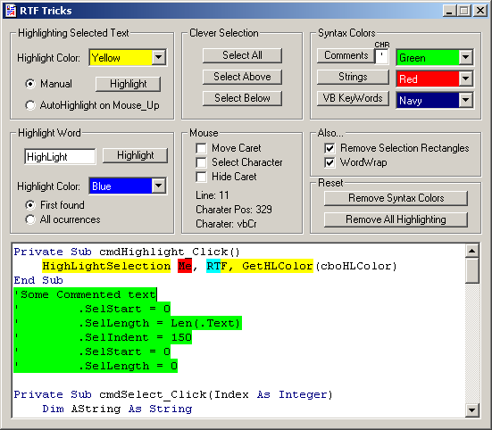



## Bobo RTF Tricks

### Description

Syntax coloring, advanced selection routines and Highlighting. Highlighting using the Richtextbox control is awkward. Whilst there are a host of Selection properties there is no Highlight property we can access from VB. We just have to parse the RTF code.
 
### More Info
 

             |
---                |---
**Submitted On**   |2002-11-04 13:06:04
**By**             |[MrBobo](https://github.com/Planet-Source-Code/PSCIndex/blob/master/ByAuthor/mrbobo.md)
**Level**          |Intermediate
**User Rating**    |4.8 (144 globes from 30 users)
**Compatibility**  |VB 6\.0
**Category**       |[String Manipulation](https://github.com/Planet-Source-Code/PSCIndex/blob/master/ByCategory/string-manipulation__1-5.md)
**World**          |[Visual Basic](https://github.com/Planet-Source-Code/PSCIndex/blob/master/ByWorld/visual-basic.md)
**Archive File**   |[Bobo\_RTF\_T1491781142002\.zip](https://github.com/Planet-Source-Code/mrbobo-bobo-rtf-tricks__1-40401/archive/master.zip)

